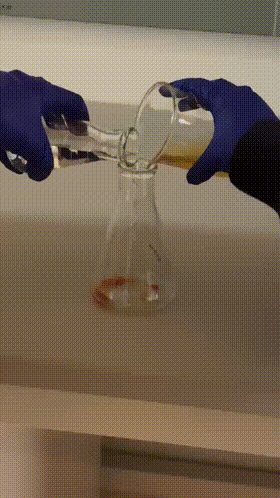
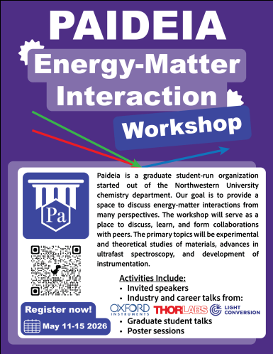

## Here's a fun little chemiluminescence reaction my general chemistry class did for the last lab session!

You can expect to see a lot more of these gifs as I continue my studies, since I really want to give my website visual components!

# First things first: Research update

Back in December I was sure I would be able to be part of both a physics and a chemistry research group. I actually kept this up for two to three months, and learned a lot about bioimaging and bioinformatics within my physics research group work. Specifically, I worked with an application known as Xenium, and I learned to classify imaging data based on gene clusters, and then export the data to make UMAPs. UMAPs seem like a fairly common technique, but this was pretty hard for me. 

### Now what about chemistry?
I was actually invited back to the chemistry research group I joined in the fall, and got my own project to work on. There is a manuscript the research group primary investigator wanted to have simulations done for, so I jumped right in! Based on a 1937 article titled "One‐Electron Rotatory Power" by E. U. Condon; William Altar; and Henry Eyring, this new manuscript proposes a symmetry adapted sum rule in the context of sum frequency generation spectroscopy! Initially, I was tasked with reading through the manuscript as best I can, and building a background to work off of. This was pretty hard! But I got to learn academic reading methods and was able to meet weekly with the PI to ask questions on topics I didn't understand (which was A LOT).

### So... something happened
At the beginning of March I suddenly had a lot of real life things and adult responsibilities to deal with, which marked the point where I could no longer maintain my classes and the heavy load of research. I had to drop the physics bioimaging research to reprioritize, and paused my chemistry research as well. But it's alright, because I learned so much from the work I already did!

### Prevailing in difficult times!

Despite the heavier challenges of March and April, as well as getting rejected to every single summer program I applied to (UChicago DENDRITES and DARN, UIUC RISE, Purdue SURF, Fermilab, etc), I still walked out of freshman year with something to do for the summer! Since I took a pause on my chemistry research, my PI suggested I come back for the summer to continue my work! I'm also planning to attend the Paideia Energy-Matter Interaction Workshop at Northwestern University, and [Purdue's Chautaqua on Nonlinear Optics program!](https://www.chem.purdue.edu/chautauqua/)

---

### One more exciting goal!!

Given all of the amazing accomplishments of the Artemis Program at NASA, a whole new genre of NASA internships have opened, particularly those that target biochemists!! So an ambitious goal I have is to try and apply to a NASA internship for the fall of 2026! I'm already confirmed to intern at Eli Lilly in the spring of 2027, so it's going to be very interesting if I have to take a year off from school! 

We shall see what becomes of this...
